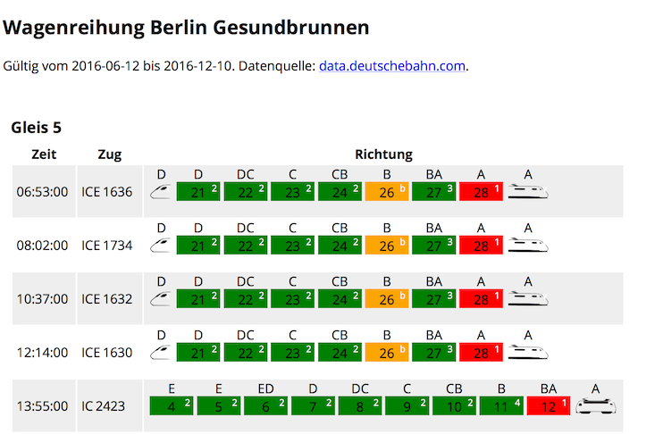
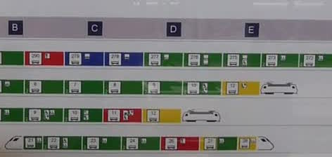

# Visualisierung der DB-Wagenreiuhngspläne aus offenen Datensätzen (XML)

Auf [http://data.deutschebahn.com](http://data.deutschebahn.com) stellt die Deutsche Bahn einige ihrer internen Datensätze als Open Data zur Verfügung. So zum Beispiel eine [xml-Datei, die die Daten zu den Wagenreihungsplänen](http://data.deutschebahn.com/dataset/data-wagenreihungsplan-soll-daten) enthält, die an vielen Fernverkehrsbahnhöfen hängen, wie z.B. dieser hier:

Mit [XSL (**EX**tensible **S**tylesheet **L**anguage)](http://www.w3schools.com/xsl/default.asp) lässt sich aus einer
XML-Datei mittels eines Tamplates eine HTML-Seite generieren. Das habe ich in diesem Beispiel genutzt, um aus der XML-Datenbankstruktur eine Visualisierung des Wagenreihungsplans ganz im Stil der Deutschen Bahn zu generieren, der nach dem derzeitigen Stand so aussieht:

## Was noch zu ändern wäre:

### Ausrichtung der Zug-Piktogramme

Beim originalen Wagenstandanzeiger sieht noch einiges anders aus. Die Züge sind so ausgerichtet, wie sie am Bahnsteig halten. Die Bahnsteigsabschnitte sind als blaue Buchstabentafeln über der Grafik markiert, wie in diesem Bild zu sehen:

Die Ausrichtung der Piktogramme wie in der Grafik der DB fiel mir jedoch schwer, da die Daten verschiedene Abschnittszordnungen zu den Waggons enthalten. Manche enthalten ein Muster wie z.B. A, AB, B, BC, C. An anderen Bahnsteigen ist dies aber so notiert: A, A, B, B, C, C. Es kommt auch vor, dass im Abschnitt A vier Waggons stehen, oder aber im Abschnitt G am anderen Ende des Bahnsteigs. Hier steht der Zug wahrscheinlich länger vorne oder hinten weg, als die Markierten Abschnitte hergeben.

Eine Methode zur Ausrichtung Zug-Piktogramme muss also noch gefunden werden.

### Weitere Steuerwagen und Lok-Typen

Piktogramme für weitere Steuerwagen und Lok-Typen müssen eingefügt werden. Typen wie z.B. "q" oder "Ü" sind in der [Dokumentation](http://download-data.deutschebahn.com/static/datasets/wagenstand/Datenbeschreibung_Wagenstandssolldaten.pdf) nicht erklärt.

### Wagen für gemischte 1. und 2. Klasse 
...brauchen noch eine spezielle Darstellung.

### Weitere Wagentypen
...brauchen noch eine Extrabehandlung.

### "halbe" Waggons
Die XML-Datei enthält Informationen zur Länge eines Waggons, was die Sitzplätze betrifft. Waggons, an deren Ende eine Steuerkabine  hängt werden auf den DB-Plänen nur halb als Waggon, halb als Steuerkabine dargestellt, sodass das Gesamtbild genau so lang ist wie jeder andere Waggon:

Dies müsste noch implementiert werden.

### Weitere Informationen
...z.B. zu Fahrtziel und Zwischenstopps des Zuges können noch in die Grafik eingefügt werden.

### Informationen zu Zugtrennung
...bzw. abweichenden Fahrtzielen bestimmter Waggons könnten noch dargestellt werden.

### Informationen zu Besonderheiten mancher Waggons
...wie z.B. Rollstuhlgerecht, Kinderabteil etc. könnten noch dargestellt werden.

### Gleis 99
In vielen Datensätzen gibt es ein "Gleis 99" oder ähnlich, dass es in wahrheit gar nicht gibt. Dort sind Muster für bestimmte Zugtypen gespeichert oder stehen irgend welche Überbleibsel. Diese müsste man aus der Darstellung heraus filtern.

### SVG-Grafiken
Die Piktogramme von Loks und Steuerwagen und andere Piktogramme sollten am besten SVG-Grafiken sein.

